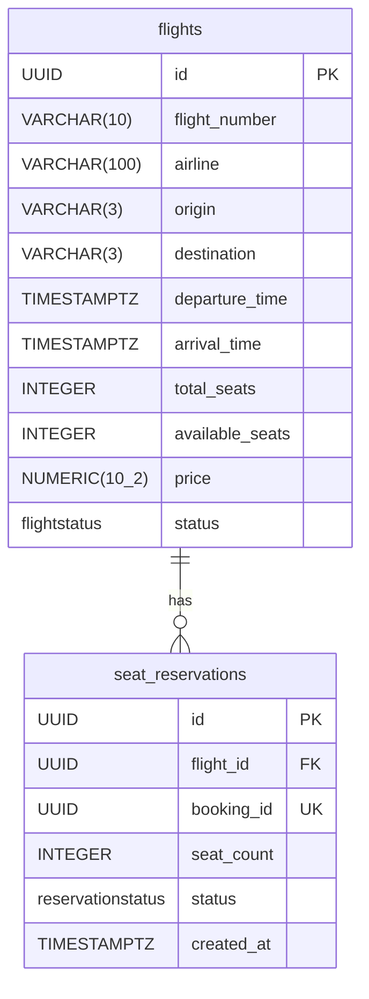
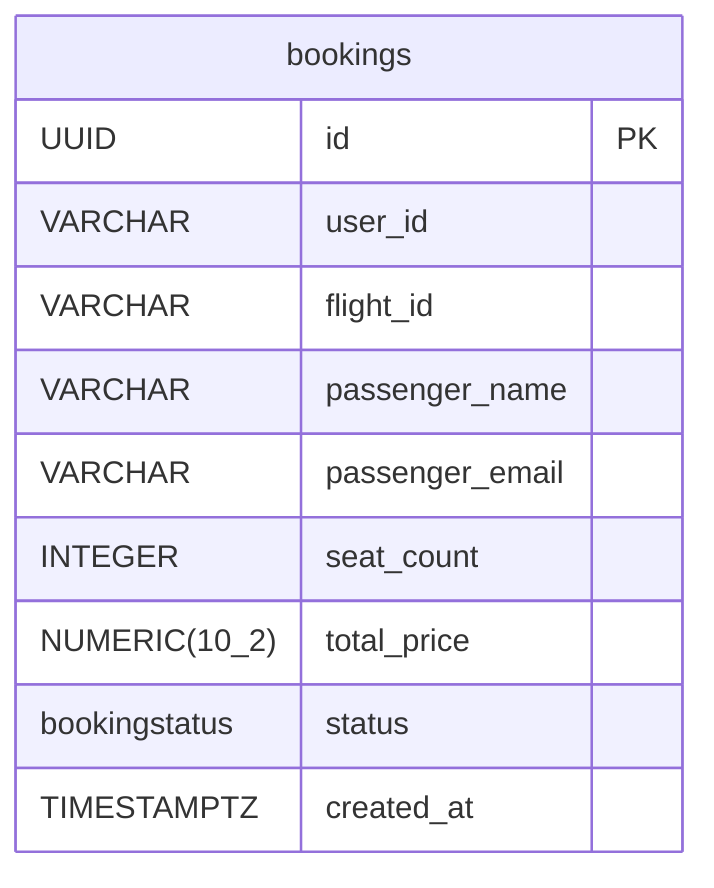

А # ER-диаграмма (3NF)

## Flight Service

**Энумы:**
- `flightstatus`: SCHEDULED | DEPARTED | CANCELLED | COMPLETED
- `reservationstatus`: ACTIVE | RELEASED | EXPIRED

**Ограничения целостности:**
- `total_seats > 0`
- `available_seats >= 0`
- `price > 0`
- `seat_count > 0`
- `booking_id` уникален (1 бронирование = 1 резервация)

---

## Booking Service

**Энумы:**
- `bookingstatus`: CONFIRMED | CANCELLED

**Ограничения целостности:**
- `seat_count > 0`
- `total_price > 0`

---

## Взаимосвязь между сервисами

`bookings.flight_id` → ссылается на `flights.id` в Flight Service (межсервисная ссылка, без FK на уровне БД).  
`seat_reservations.booking_id` → соответствует `bookings.id` из Booking Service (без FK, разные БД).
